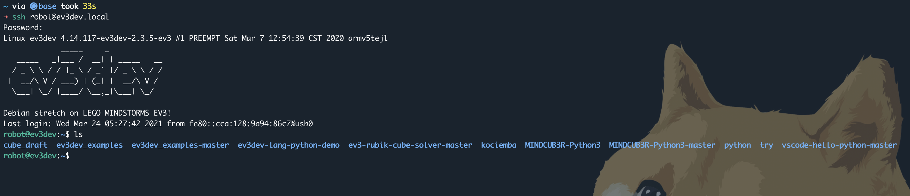
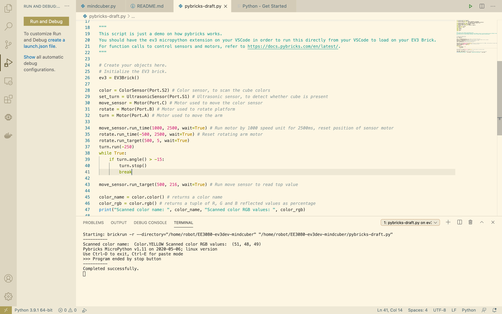
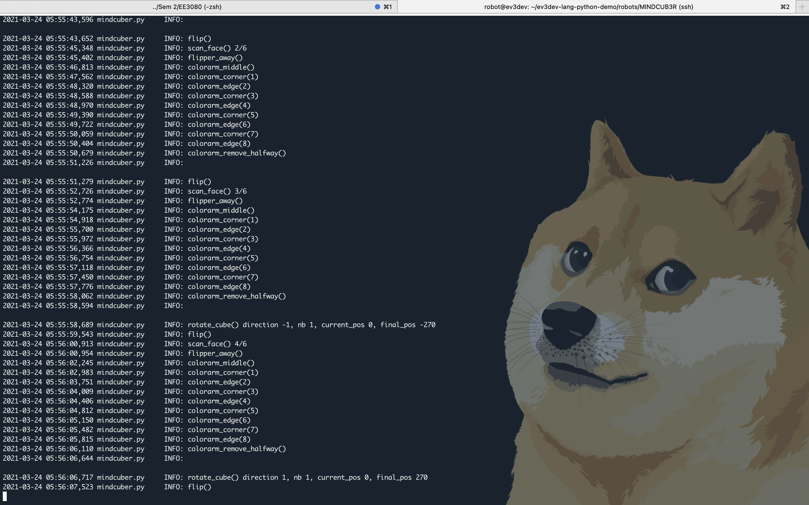

# EE3080 DIP 2021
# MINDCUB3R Project Using ev3dev2

## Disclaimer
- We refer to the original MINDCUB3R code at https://github.com/ev3dev/ev3dev-lang-python-demo/blob/stretch/robots/MINDCUB3R/mindcuber.py
- Some modifications to the script are changing InfraredSensor to UltrasonicSensor, changing the UltrasonicSensor detection of the cube, and calibrating the rotation and speed for each motors and color sensor. 

## Prerequisite
- Follow the steps as guided by https://github.com/ev3dev/ev3dev-lang-python-demo/blob/stretch/robots/MINDCUB3R/mindcuber.py 
- Crucial libraries needed are `kociemba`, a library used to call the pruning algorithm for shortest path to solving rubik cube from its input color matrix. Another library is `rubikscolorresolver` which analyzes the RGB input values to categorize into 6 color outputs.
- You need to be adept in Linux usage to instal the neccessary libraries stated. `pip3` for this Debian is very slow and be careful when you use `sudo` for your apt-get.
- EV3 Brick runs Debian Linux OS on Raspberry Pi. A secure-server shell (SSH) can be establish from your laptop terminal to connect to the EV3 brick "computer".
- To SSH into EV3 brick, type in your terminal:
```.bash
ssh robot@ev3dev.local
```
- The default password (when prompted) is `maker`. Your robot needs to be connected to your laptop via USB cable.
- The interface when you are inside the robot should look like this:
- 
- You can check out the Linux command lines over here: https://cheatography.com/davechild/cheat-sheets/linux-command-line/. Basic commands are `cd` to go to your desired directory, `ls` to list files in current directory, and `python3 [file name]` to run a python file.
- In order to edit codes on Linux terminal, I use vim with the command `vim [file name]`. Check out vim shortcuts here: https://vim.rtorr.com/
- Other ways to connect to the robot includes installing micropython and use `pybricks` library. The documentations for pybricks is here https://docs.pybricks.com/en/latest/. Check out the `pybricks-draft.py` file to see my demo code, with the output looking like below! Still I prefer to use SSH with ev3dev environment hehe.
- 

## Run the code
- Git clone this repo.
- Ensure you already run all the neccessary installations in the prerequisite part.
- Run in the SSH terminal:
```.bash
./mindcuber.py
```
- The solver script takes quite a while to run. Be patient! While running, your terminal will print out which step it is on like below:
- 
